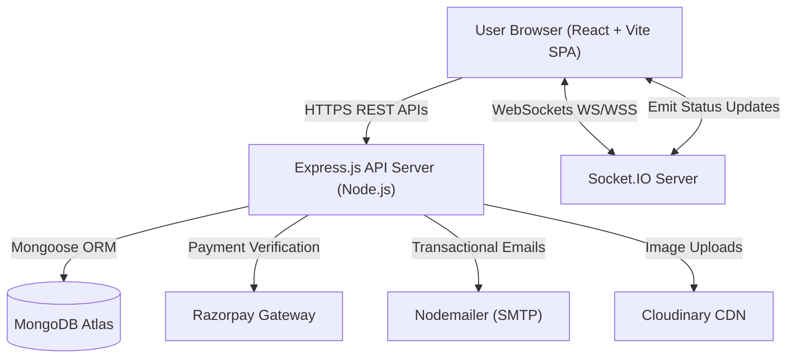
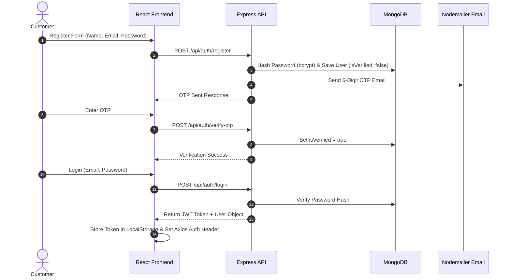

# PizzaHub — System Architecture (HLD & LLD)

**Version:** 1.0  
**Document Type:** Technical Architecture Blueprint  
**Stack:** MERN (MongoDB, Express.js, React.js, Node.js) + Socket.IO + Razorpay + Nodemailer

---

## 1. Objective

This document defines the complete system architecture for **PizzaHub**. It establishes:
- High-Level Architecture (HLD) & Client-Server boundaries
- Low-Level Architecture (LLD) & Component Execution Flows
- Database interaction & Schema responsibilities
- Authentication & Authorization strategy (JWT + Role-Based)
- Payment workflow integration (Razorpay + Webhook/Verification)
- Inventory management & Automated Stock Alerts
- Real-time Socket.IO event architecture
- Security strategy & Scalability principles

---

## 2. Architecture Principles

1. **Separation of Concerns:** Clear boundary between Presentation (React), API Routing (Express), Business Logic (Controllers/Services), and Data Layer (Mongoose/MongoDB).
2. **Clean Architecture & MVC Pattern:** Routes handle endpoints, Controllers manage HTTP inputs/outputs, Services execute business rules, and Models perform database operations.
3. **Stateless API Design:** RESTful endpoints authenticated via JWT bearer tokens.
4. **Real-time Event Synchronization:** Socket.IO rooms for targeted event broadcasts (`joinOrderRoom`, `joinAdminRoom`).
5. **Security by Design:** Inputs validated, passwords hashed with `bcrypt`, security headers with `helmet`, rate limiting enabled, and sensitive assets stored in environment variables.

---

## 3. High-Level Architecture (HLD)



---

## 4. Low-Level Architecture (LLD) — Execution Flow

```
[React UI Component] 
       │
       ▼ (Dispatches Action / Event)
[React Context / Hook] 
       │
       ▼ (HTTP Request)
[Axios Service Client] 
       │
       ▼ (JSON payload over HTTPS)
[Express Route Layer] 
       │
       ▼ (Middleware: JWT Auth / Validation)
[Express Controller] 
       │
       ▼ (Executes Business Logic & Stock Checks)
[Mongoose Model / Service] 
       │
       ▼ (Queries / Mutations)
[MongoDB Atlas Database] 
       │
       ▼ (Real-time Broadcast Trigger)
[Socket.IO Event Hub] ──► (Pushes payload to connected clients)
       │
       ▼ (HTTP JSON Response)
[React UI State Update]
```

---

## 5. Technology Responsibilities

| Technology | Layer | Primary Responsibilities |
| :--- | :--- | :--- |
| **React.js + Vite** | Frontend SPA | UI Rendering, Routing (`react-router-dom`), State Management (Context API), Client Socket Listener |
| **Express.js** | Backend REST API | Endpoint Routing, Middleware Execution, JWT Validation, Controller Orchestration |
| **MongoDB + Mongoose** | Database | Persistence for Users, Pizzas, Ingredients, Orders, Coupons, and Payments |
| **Socket.IO** | WebSockets | Real-time order status tracking, kitchen notifications, stock alerts |
| **Razorpay** | Payment Gateway | Order creation, cryptographic signature verification, payment status persistence |
| **Nodemailer** | Email Service | OTP verification, invoice receipts, low stock alerts to store admins |
| **Node Cron** | Scheduler | Automated background jobs (daily analytics aggregation, stock audit) |

---

## 6. Authentication & Authorization Workflow



---

## 7. Order & Inventory Management Workflow

1. **Customization / Builder:** Customer selects base crust, sauce, cheese, and toppings.
2. **Stock Reservation:** System verifies ingredient stock quantities (`quantity >= required`).
3. **Payment Initiation:** System creates Razorpay order reference.
4. **Verification & Deduction:** Upon signature verification, ingredient quantities are decremented:
   $$\text{Remaining Stock} = \text{Stock} - \text{Quantity Used}$$
5. **Low Stock Trigger:** If $\text{Remaining Stock} \le \text{Threshold}$, an automated stock alert is logged and emitted to admins via Socket.IO.
6. **Live Tracking:** Order status updates (`pending` → `confirmed` → `preparing` → `in-kitchen` → `ready` → `out-for-delivery` → `delivered`) emit real-time Socket events to the customer's room.

---

## 8. Security Architecture & Safeguards

- **Authentication:** Statistically secure JWT tokens with expiry headers (`JWT_SECRET`).
- **Authorization:** `protect` and `adminOnly` middleware checks on sensitive endpoints.
- **Password Hashing:** `bcryptjs` with salt rounds = 10.
- **Input Sanitization:** Structured data schemas preventing NoSQL injection.
- **Rate Limiting & Headers:** Express API protected with standard CORS origin limits and security headers.
- **Environment Isolation:** Sensitive credentials stored strictly in `.env` files.

---

## 9. Folder Structure Overview

```
PizzaHub/
├── backend/
│   ├── src/
│   │   ├── config/         # Database & app configuration
│   │   ├── controllers/    # API request handlers
│   │   ├── middleware/     # Auth, validation & error handlers
│   │   ├── models/         # Mongoose schemas (User, Order, Pizza, etc.)
│   │   ├── routes/         # Express endpoint definitions
│   │   ├── utils/          # Helpers (Nodemailer, Razorpay, Tokens)
│   │   └── server.js       # App entry point & Socket.IO server initialization
│   └── package.json
└── frontend/
    ├── src/
    │   ├── components/     # Reusable UI components (Button, Input, StatusBadge, Cards)
    │   ├── context/        # Global state (AuthContext, CartContext, SocketContext)
    │   ├── pages/          # Application views (Menu, Builder, Cart, Checkout, Admin)
    │   ├── index.css       # Tailwind CSS & design tokens
    │   └── App.jsx         # Main router setup
    └── package.json
```
