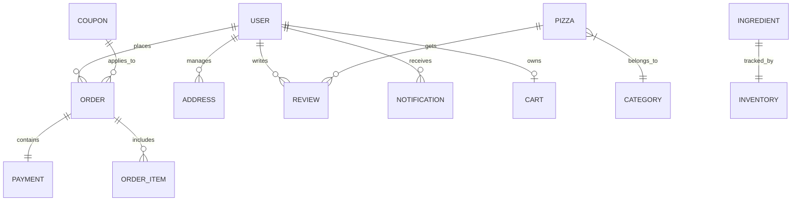

# PizzaHub — Database Design & Data Modeling (Part 4)

**Version:** 1.0  
**Document Type:** Database Architecture Blueprint  
**Database:** MongoDB Atlas / Local MongoDB  
**ODM:** Mongoose (Node.js)

---

## 1. Objective

Design a normalized, scalable, and production-ready MongoDB schema for **PizzaHub**. The database structure supports:
- User Authentication & Role Management
- Pizza Catalog & Category Classification
- Custom Pizza Builder & Ingredient Selection
- Cart Persistence & Checkout Calculations
- Order Lifecycle & Real-time Tracking
- Payment Transaction Records (Razorpay)
- Ingredient Stock & Low-Stock Alerts
- Promotional Coupons & Discount Limits
- Ratings, Reviews, Wishlists, Notifications & Admin Analytics

---

## 2. Entity Relationship Overview (Logical)

---

## 3. Collections & Schema Specification

### 3.1 `users` Collection
- `_id`: ObjectId
- `name`: String (Required, trimmed)
- `email`: String (Required, unique, indexed)
- `phone`: String (Required, unique)
- `password`: String (Hashed with bcrypt)
- `role`: String (`user` | `admin`, Default: `user`)
- `isVerified`: Boolean (Default: `false`)
- `otp`: String (Optional, 6-digit email OTP)
- `otpExpires`: Date (Optional)
- `createdAt`, `updatedAt`: Date (Timestamps)

---

### 3.2 `pizzas` Collection
- `_id`: ObjectId
- `name`: String (Required, unique)
- `description`: String
- `category`: String (`veg` | `non-veg` | `special` | `premium`)
- `basePrice`: Number (Required)
- `image`: String (URL)
- `isAvailable`: Boolean (Default: `true`)
- `rating`: Number (Default: `4.5`)
- `reviewCount`: Number (Default: `0`)
- `createdAt`, `updatedAt`: Date

---

### 3.3 `ingredients` Collection
- `_id`: ObjectId
- `name`: String (Required, unique)
- `type`: String (`crust` | `sauce` | `cheese` | `veggie` | `meat`)
- `price`: Number (Required)
- `quantity`: Number (Current stock in units)
- `threshold`: Number (Low stock threshold alert)
- `inStock`: Boolean (Default: `true`)
- `createdAt`, `updatedAt`: Date

---

### 3.4 `orders` Collection
- `_id`: ObjectId
- `user`: Ref -> `User` (ObjectId)
- `items`: Array of:
  - `pizza`: Ref -> `Pizza` (Optional)
  - `name`: String
  - `size`: String (`small` | `medium` | `large`)
  - `quantity`: Number
  - `price`: Number
  - `isCustom`: Boolean
  - `customization`: Object (`base`, `sauce`, `cheese`, `vegetables`, `meats`)
- `shippingAddress`: Object (`street`, `city`, `zipCode`)
- `phone`: String
- `totalAmount`: Number (Subtotal)
- `couponCode`: String
- `discountAmount`: Number
- `gst`: Number (5%)
- `deliveryCharges`: Number
- `grandTotal`: Number
- `status`: String (`pending` | `confirmed` | `preparing` | `in-kitchen` | `ready` | `out-for-delivery` | `delivered` | `cancelled`)
- `paymentStatus`: String (`pending` | `completed` | `failed` | `refunded`)
- `paymentId`: String
- `razorpayOrderId`: String
- `createdAt`, `updatedAt`: Date

---

### 3.5 `coupons` Collection
- `_id`: ObjectId
- `code`: String (Required, uppercase, unique)
- `discountPercentage`: Number (Required)
- `maxDiscount`: Number (Required)
- `minOrderValue`: Number (Required)
- `expiryDate`: Date (Required)
- `isActive`: Boolean (Default: `true`)
- `createdAt`, `updatedAt`: Date

---

## 4. Indexing Strategy

To maintain sub-50ms query response times:
1. `users`: Index on `email` (unique) and `phone` (unique).
2. `pizzas`: Index on `category` and `isAvailable`.
3. `ingredients`: Index on `type` and `quantity`.
4. `orders`: Index on `user`, `status`, and `createdAt` (descending for tracking & history).
5. `coupons`: Index on `code` (unique) and `expiryDate`.

---

## 5. Transactions & Soft Deletes

- **MongoDB Transactions:** Order placement, payment verification, and ingredient stock reduction execute within atomicity guarantees:
  $$\text{Stock}_{\text{new}} = \text{Stock}_{\text{current}} - \text{Quantity}_{\text{used}}$$
- **Soft Deletes:** Critical entities like pizzas and coupons use `isAvailable` / `isActive` flags instead of hard removal to maintain past order analytics integrity.
